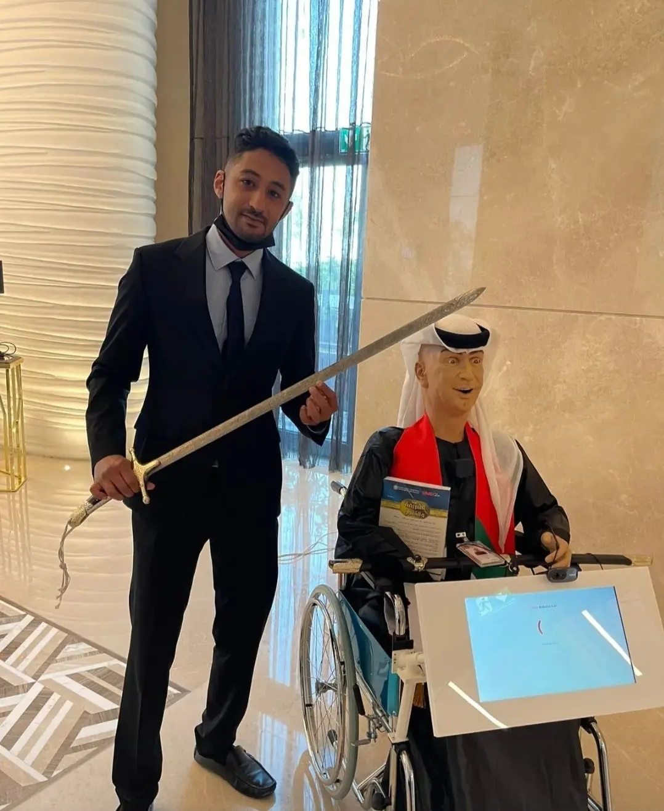
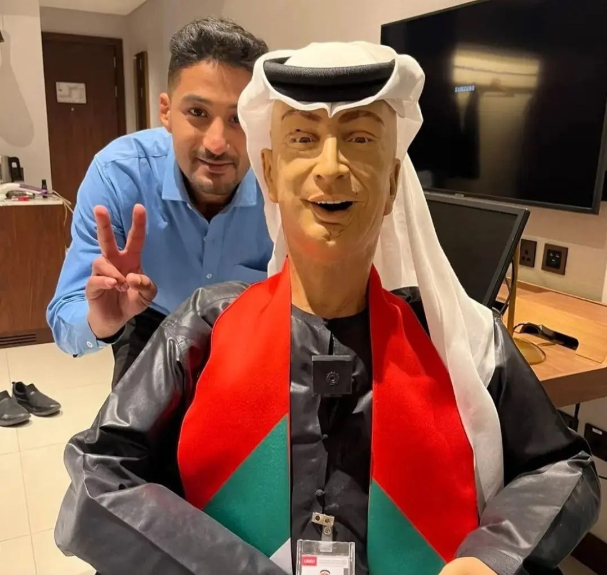
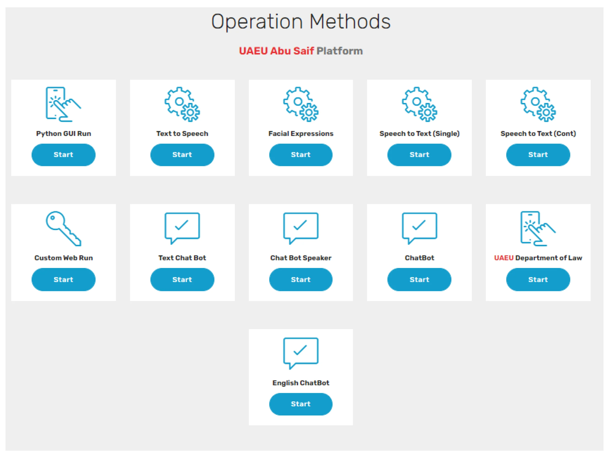
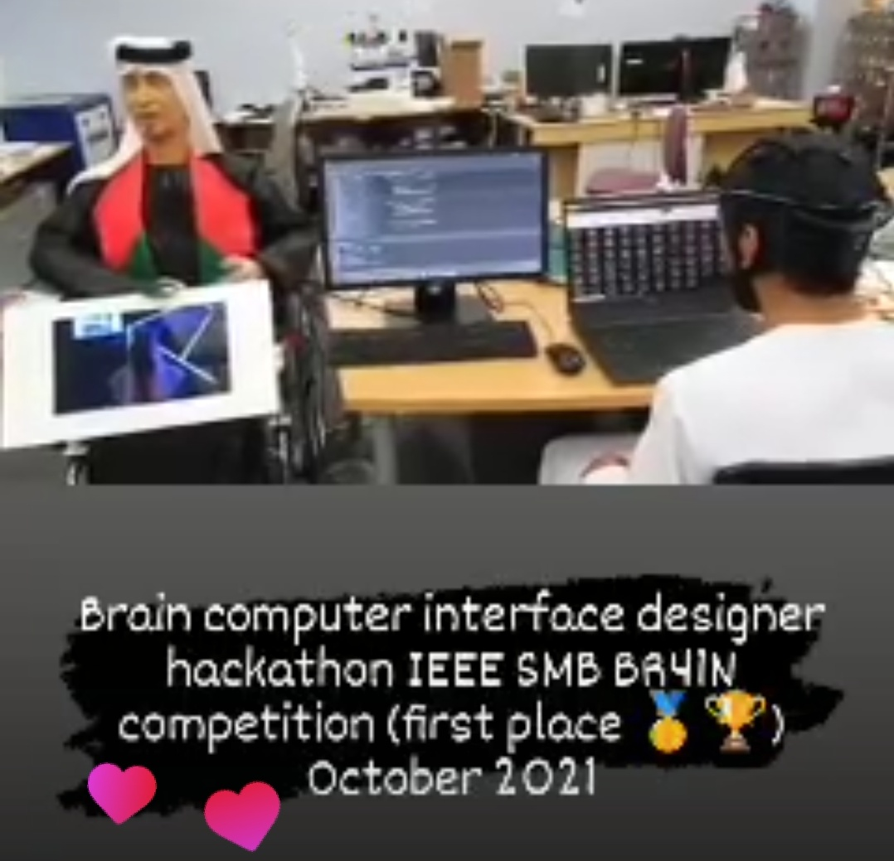

# Web Platform for General Robot Controlling System

A web-based platform for controlling, monitoring, and interacting with robotic systems through a unified interface.

This research project explores a flexible architecture that integrates **robotics, artificial intelligence, computer vision, speech interaction, navigation, simulation, cloud services, and web technologies** into a unified robot-control platform.

The platform was developed and evaluated through research involving the **AbuSaif social robot** and contributed to research publications on generalized robot control and cloud-based social robotics.

---

## 🤖 AbuSaif Robot

The AbuSaif Robot was used as one of the physical robotic platforms for developing and testing intelligent interaction and robot-control capabilities.

<p align="center">
  
  &nbsp;&nbsp;
  
</p>

The platform integrates multiple components required for social and interactive robotics, including perception, communication, motion control, AI services, and remote interaction.

---

## 🖥️ Web-Based Robot Control Platform

A central component of the project is a web-based interface designed to provide access to robot functionality through a unified control environment.

<p align="center">
  
</p>

The platform was designed to connect users, intelligent services, and robotic hardware through web technologies and backend services.

Major capabilities include:

- Web-based robot control
- Robot motion and actuator control
- Remote operation
- Computer vision
- Facial-expression analysis
- Speech-to-text
- Text-to-speech
- Conversational interaction
- Navigation and mapping
- Joystick control
- ROS/Gazebo simulation
- AI and machine-learning components
- Cloud-connected robot services

---

## 🧠 Human-Robot Interaction and Artificial Intelligence

The platform incorporates several technologies for intelligent human-robot interaction.

### Computer Vision

Computer-vision components support functionality including:

- Face detection
- Face recognition
- Facial-expression recognition
- Object detection
- Visual tracking
- Camera-based perception

The project includes both browser-based and Python-based computer-vision components.

### Speech and Conversational Interaction

The platform includes components supporting:

- Speech-to-text
- Text-to-speech
- Continuous speech recognition
- Conversational interaction
- Intent recognition
- Predefined robot responses
- Facial-expression processing

These capabilities were developed to support more natural communication between users and social robotic systems.

---

## ⚙️ Robot Control

The platform provides interfaces and backend components for controlling robotic operations.

Robot functionality includes:

- Robot motion
- Dynamixel actuator communication
- Navigation
- Joystick control
- Robot operation commands
- Remote interaction
- Sensor and actuator integration

The objective is to provide a software architecture that can connect multiple robot capabilities through a common web-accessible interface.

---

## 🗺️ Navigation and Mapping

The system includes functionality related to robot navigation and environmental mapping:

- Robot navigation commands
- Saved maps
- Map loading
- Map creation
- GPS-related functionality
- Joystick-based navigation

---

## 🎮 ROS and Simulation

The repository contains a ROS/Catkin workspace for robotic simulation and system integration.

Components include:

- ROS packages
- Gazebo simulation environments
- Robot GUI bridge
- Launch files
- Navigation interfaces
- Simulation worlds

Simulation enables components of the robot-control architecture to be evaluated before or alongside deployment on physical robotic systems.

---

## 🏗️ System Architecture

A simplified representation of the platform is:

```text
                    User / Web Browser
                           │
                           ▼
                  Web Control Platform
                           │
                           ▼
             Backend & Communication Layer
              (PHP / Python / Node.js)
                           │
          ┌────────────────┼────────────────┐
          │                │                │
          ▼                ▼                ▼
   AI / Computer      Speech & HRI      ROS / Gazebo
      Vision                              Simulation
          │                │                │
          └────────────────┼────────────────┘
                           │
                           ▼
                    Robot Interface
                           │
              ┌────────────┼────────────┐
              ▼            ▼            ▼
           Motors       Sensors      Actuators
```

---

## 🧩 Technologies

### Programming and Software Development

- Python
- PHP
- JavaScript
- HTML
- CSS
- Shell scripting
- Node.js

### Robotics

- ROS
- Gazebo
- Dynamixel SDK
- Robot navigation
- Motion control
- Sensor and actuator integration

### Artificial Intelligence

- Computer vision
- Object detection
- Face recognition
- Facial-expression analysis
- Speech recognition
- Natural-language interaction
- Machine learning

### Web and Cloud Technologies

- PHP
- JavaScript
- HTML/CSS
- Bootstrap
- Node.js
- APIs
- Databases
- Web-based robot interfaces
- Cloud-connected services

---

## 📁 Project Structure

```text
prototype/
│
└── en/
    ├── controlpanel/
    │   ├── assets/
    │   ├── gps/
    │   ├── joystick/
    │   ├── livecamera/
    │   ├── loadamap/
    │   ├── nodecontinuousspeech/
    │   ├── pythoncode/
    │   ├── savedmaps/
    │   ├── simulation_ws/
    │   └── ...
    │
    └── ...
```

The `controlpanel` directory contains the main interfaces and services used by the robotics platform.

---

# 🏆 IEEE SMC BR41N Brain-Computer Interface Hackathon — 1st Place

The broader robotics and human-interaction research associated with this work also contributed to participation in the **Brain Computer Interface Designers' Hackathon, IEEE SMC BR41N Competition**, where our team achieved **1st Place**.

<p align="center">
  
</p>

The competition explored innovative approaches at the intersection of **brain-computer interfaces, intelligent systems, human-machine interaction, and assistive technologies**.

### 🥇 Winner Certificate

<p align="center">
  
</p>

**Achievement:** 1st Place — IEEE SMC BR41N Brain-Computer Interface Hackathon

---

# 🔬 Research Publications

This project and the broader research surrounding the AbuSaif social-robotics platform contributed to research in **generalized robot control, cloud robotics, social robotics, artificial intelligence, and robot autonomy**.

## 1. Web Platform for General Robot Controlling System

**Mohammed Abduljabbar and Fady Alnajjar**

*2022 International Conference on Electrical and Computing Technologies and Applications (ICECTA)*

The work presents a web-based approach for providing generalized access to robot-control capabilities and integrating robotic systems with web and intelligent services.

📄 **IEEE Xplore:**  
https://ieeexplore.ieee.org/abstract/document/9990192

### Citation

```bibtex
@inproceedings{abduljabbar2022web,
  title={Web Platform for General Robot Controlling System},
  author={Abduljabbar, Mohammed and Alnajjar, Fady},
  booktitle={2022 International Conference on Electrical and Computing Technologies and Applications (ICECTA)},
  year={2022},
  organization={IEEE}
}
```

---

## 2. Revolutionizing Social Robotics: A Cloud-Based Framework for Enhancing the Intelligence and Autonomy of Social Robots

**A. O. Elfaki, Mohammed Abduljabbar, L. Ali, F. Alnajjar, D. Mehiar, A. M. Marei, et al.**

*Robotics*, **12**(2), 48, 2023.

This research investigates a cloud-based framework for improving the **intelligence, autonomy, and capabilities of social robotic systems** through integration with cloud and AI services.

📄 **Robotics (MDPI):**  
https://www.mdpi.com/2218-6581/12/2/48

### Citation

```bibtex
@article{elfaki2023revolutionizing,
  title={Revolutionizing Social Robotics: A Cloud-Based Framework for Enhancing the Intelligence and Autonomy of Social Robots},
  author={Elfaki, Ahmed O. and Abduljabbar, Mohammed and Ali, L. and Alnajjar, F. and Mehiar, D. and Marei, A. M. and others},
  journal={Robotics},
  volume={12},
  number={2},
  pages={48},
  year={2023},
  publisher={MDPI}
}
```

---

## 🎯 Research Motivation

The long-term motivation behind this research is to reduce the dependency of robot-control interfaces on individual robotic platforms.

A generalized architecture can make it easier to integrate:

- Different robotic platforms
- Artificial-intelligence services
- Computer-vision systems
- Human-robot interaction modules
- Cloud services
- Sensors and actuators
- Navigation systems
- Simulation environments

within a common software ecosystem.

The broader goal is to enable robots to benefit from distributed computational resources and intelligent services while providing researchers and operators with accessible interfaces for interaction, monitoring, and control.

---

## 🔐 Security Notice

Credentials, API keys, OAuth files, service-account credentials, private configuration files, and other sensitive information are intentionally excluded from the public repository.

Users wishing to deploy the platform should configure their own credentials and environment-specific settings.

---

## ⚠️ Research Prototype

This repository contains a research prototype developed over multiple stages of experimentation.

Some components rely on older versions of:

- Python
- PHP
- ROS
- Gazebo
- Node.js
- External APIs
- Machine-learning libraries
- Cloud services

As a result, some components may require dependency updates or configuration changes before running in a modern environment.

The repository is maintained primarily for **research, educational, demonstration, and archival purposes**.

---

# 👨‍💻 Author

## Dr. Mohammed Abduljabbar

**PhD in Informatics and Computing**  
United Arab Emirates University

Research interests include:

- Artificial Intelligence
- Robotics
- Human-Robot Interaction
- Computer Vision
- Deep Learning
- Spatiotemporal AI
- Digital Twins
- Embodied AI
- Human Augmentation
- Intelligent Systems

### Research Profiles

**Google Scholar**  
https://scholar.google.com/citations?user=TTi9JRkAAAAJ

**GitHub**  
https://github.com/Moe-Nurtech

---

## 📚 References

1. M. Abduljabbar and F. Alnajjar, **"Web Platform for General Robot Controlling System,"** 2022 International Conference on Electrical and Computing Technologies and Applications (ICECTA), IEEE.  
   https://ieeexplore.ieee.org/abstract/document/9990192

2. A. O. Elfaki, M. Abduljabbar, L. Ali, F. Alnajjar, D. Mehiar, A. M. Marei, et al., **"Revolutionizing Social Robotics: A Cloud-Based Framework for Enhancing the Intelligence and Autonomy of Social Robots,"** *Robotics*, vol. 12, no. 2, article 48, 2023.  
   https://www.mdpi.com/2218-6581/12/2/48

---

## 📜 License

Please refer to the repository license for terms of use.
